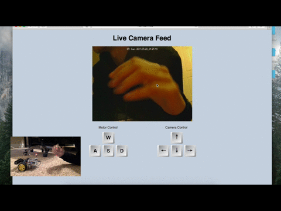
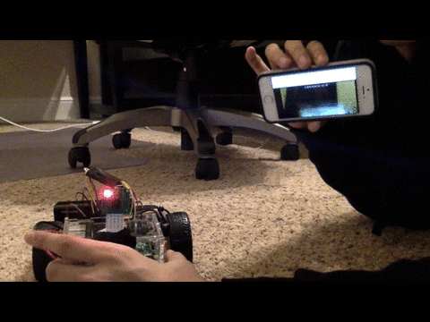
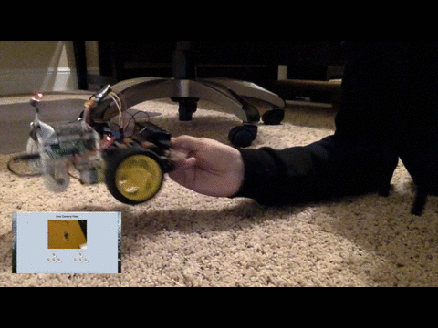

# PiCar
###### Python based RC car a with live camera feed. Made using a Raspberry Pi and wirelessly controlled from a website.

---

Live camera feed from PiCar to website on laptop  

Live camera feed from PiCar to phone  

Moving motors in reverse using `S` key on keyboard  

---

##### Future improvements:
- Add accelerometer control to touchscreen devices to control PiCar (currently working on this)
- Make PiCar look better
